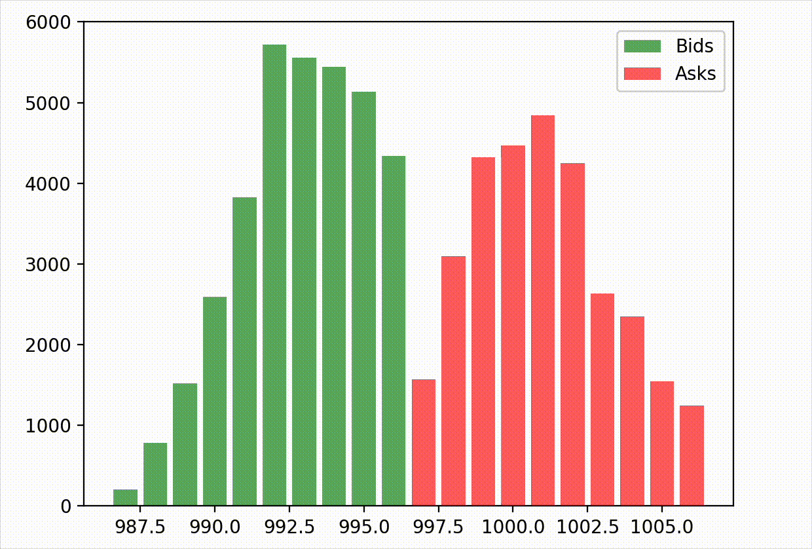

# ⚡ LOB-Engine: Ultra-Low Latency Limit Order Book


> **A hybrid trading engine featuring a C++20 core for nanosecond-level execution and Python bindings for strategy research & visualization.**


*(Real-time order book depth visualization running via the Python API)*

## 📖 Overview
This project implements a **Limit Order Book (LOB)** designed for High-Frequency Trading (HFT) simulations. It addresses the "Two-Language Problem" in quantitative finance by using **C++** for the heavy lifting (matching logic, memory management) and **Python** for the user interface and data analysis.

The engine achieves **~108 nanoseconds** per match operation on standard hardware, making it suitable for realistic market microstructure simulations.

## 🚀 Key Features
* **Performance:** Optimized C++20 implementation using `std::map` for price levels and Double-Linked Lists for **O(1)** order cancellation.
* **Hybrid Architecture:** Seamless Python integration via `pybind11`, allowing direct access to C++ objects from Python scripts.
* **Smart Pointers:** Memory management handled via `std::shared_ptr` and `std::weak_ptr` to prevent leaks while maintaining speed.
* **Visualization:** Includes a real-time market depth monitor built with `matplotlib`.
* **Benchmarking:** Integrated Google Benchmark suite to verify latency metrics.

## 📊 Performance Benchmarks
Benchmarks were run on Apple Silicon (M2 Air) using single-threaded execution.

| Operation | Time (ns) | Description |
| :--- | :--- | :--- |
| **Match Order** | **108 ns** | Time to execute a trade against a resting order. |
| **Add Passive** | **450 ns** | Time to insert a resting Limit Order into the book. |

*> Benchmarks generated using `benchmarks/main_bench.cpp` via Google Benchmark.*

## 📦 Installation

### Prerequisites
* C++ Compiler supporting C++20 (Clang/GCC)
* CMake (3.20+)
* Python 3.10+

### Build Instructions
```bash
# 1. Clone the repository
git clone https://github.com/Sachit-Juneja/LOB-Engine.git
cd LOB-Engine

# 2. Set up a virtual environment (Recommended)
python3 -m venv venv
source venv/bin/activate
pip install matplotlib "numpy<2.0"

# 3. Compile the Engine
mkdir build && cd build
cmake .. -DPython3_EXECUTABLE=$(which python)
make
```

## 💻 Usage

### 1. Running the Visual Simulator
Launch the real-time market monitor to see the engine in action:
```bash
# Inside /build directory
python market_sim.py
```

### 2. Using the API in Python
You can import the compiled C++ library directly into your Python scripts:

```python
import lob_python as lob

# Initialize the C++ Engine
book = lob.OrderBook()

# Add a Limit Buy Order at $100
book.add_order(id=1, price=100, quantity=10, side=lob.Side.BUY, type=lob.OrderType.LIMIT)

# Add a matching Sell Order (Executes instantly)
book.add_order(id=2, price=100, quantity=5, side=lob.Side.SELL, type=lob.OrderType.LIMIT)

# Inspect the Book
bids = book.get_bids()
print(f"Top Bid: {bids[0]}") # Output: [100, 5]
```

## 🧪 Running Tests & Benchmarks
To verify system stability and performance:

```bash
# Run Latency Benchmarks (C++)
./lob_benchmark

# Run Integration Tests (Python)
python3 ../tests/test_engine.py
```

## 🔮 Future Improvements
* Implement a **slab allocator** to reduce memory fragmentation overhead.
* Add support for **Market Orders** (currently treats all as Limit).
* Implement a TCP/UDP Gateway to accept orders over a network socket.

## 📄 License
MIT License.